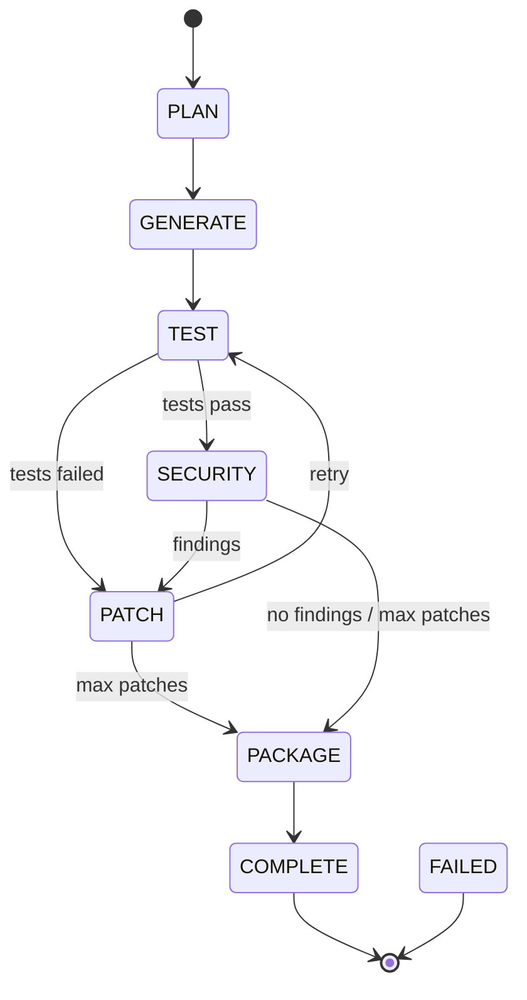

# ArchitectAI — System Architecture

## 1. Overview
ArchitectAI is an agentic control-plane and runtime that converts plain-language Product Goals into runnable SaaS projects. The system uses a LangGraph StateGraph to implement an explicit workflow: PLAN → GENERATE → TEST → (PATCH loop) → SECURITY → (PATCH loop) → PACKAGE. Agents are specialized LLM-backed workers that operate on structured AgentState objects stored/transmitted by the orchestration runtime.

This document explains components, state machine behavior, communication contracts, database schema, API surface, SSE event protocol, security model, Docker topology, and scaling strategies.

## 2. Component Diagram

```mermaid
flowchart LR
  subgraph Frontend
    FD[Frontend Dashboard\n(Next.js + SSE)]
  end
  subgraph Backend
    API[FastAPI Control Plane]
    ORCH[LangGraph Orchestrator]
    CODER[Coder Agent]
    TESTER[Tester Agent]
    SEC[Security Auditor]
    BUNDLE[Bundle Service]
    JOBS[Job Worker / run_job]
  end
  DB[(PostgreSQL + pgvector)]
  REDIS[(Redis)]
  NGINX[NGINX Reverse Proxy]

  FD -->|POST goal| API
  API --> JOBS
  JOBS --> ORCH
  ORCH --> CODER
  ORCH --> TESTER
  ORCH --> SEC
  ORCH --> BUNDLE
  API --> DB
  JOBS --> REDIS
  FD -->|SSE| API
  API --> NGINX
  NGINX --> FD
  DB -->|store| API
  REDIS -->|pub/sub| API
```

## 3. LangGraph State Machine

The LangGraph StateGraph drives workflow transitions. States and transitions below match the implementation in backend/app/pipeline/graph.py.



State names (canonical): PLAN, GENERATE, TEST, PATCH, SECURITY, PACKAGE, COMPLETE, FAILED

## 4. Agent Communication Protocol

Agents exchange and operate on a typed AgentState (see backend/app/pipeline/state.py). This TypedDict is the canonical protocol between nodes. Agents should treat fields as read/write as documented below.

AgentState fields (selected):
- job_id (str) — unique job identifier
- project_id (str) — owning project identifier
- product_goal (str) — original user-supplied goal
- tech_stack (dict) — planner output (frontend/backend/db choices)
- file_plan (List[dict]) — ordered files to generate (path, description, file_type, priority)
- generated_files (dict) — map path → content (updated by CoderAgent)
- current_file_index (int) — progress index for generation
- test_files (dict) — generated test files (path → content)
- test_results (List[dict]) — individual TestResult dicts
- bug_reports (List[dict]) — structured bug reports produced by TesterAgent
- patch_attempts (int) — counts patches applied so far
- security_findings (List[dict]) — aggregated security issues
- security_passed (bool) — security gate boolean
- current_phase (Literal[...]) — current workflow phase
- iteration (int) — loop iteration counter
- errors (List[str]) — non-fatal error messages for diagnostics
- bundle_path (Optional[str]) — path to produced ZIP artifact
- messages (list) — messages to be emitted to event service (SSE)

Read/write rules:
- Orchestrator.plan writes: tech_stack, file_plan, current_phase
- Coder.generate_file writes into generated_files progressively
- Tester.generate_tests writes test_files, run_python_tests writes test_results
- Tester.analyze_failures writes bug_reports
- Coder.patch_file modifies generated_files based on bug_reports
- Security.scan writes security_findings and security_passed
- BundleService writes bundle_path and final artifact metadata

Agents must avoid clobbering fields they don't own; prefer merging (e.g., update generated_files dict) and preserve existing messages.

## 5. Database Schema

Key tables (conceptual) and relationships are implemented via SQLAlchemy models under backend/app/models.

```mermaid
erDiagram
  PROJECTS {
    int id PK
    string name
    string description
    string product_goal
    datetime created_at
  }
  JOBS {
    int id PK
    int project_id FK
    string status
    string product_goal
    datetime started_at
    datetime finished_at
  }
  ARTIFACTS {
    int id PK
    int job_id FK
    string path
    bytes content (stored on disk, metadata in DB)
  }
  AGENT_MESSAGES {
    int id PK
    int job_id FK
    string agent
    json payload
    datetime created_at
  }
  TEST_RUNS {
    int id PK
    int job_id FK
    string test_file
    bool passed
    text output
    int duration_ms
  }
  BUG_REPORTS {
    int id PK
    int job_id FK
    string file_path
    string error_type
    text error_message
    text traceback
    string severity
  }
  SECURITY_FINDINGS {
    int id PK
    int job_id FK
    string file_path
    int line_number
    string severity
    string owasp_category
    text description
  }

  PROJECTS ||--o{ JOBS : owns
  JOBS ||--o{ ARTIFACTS : creates
  JOBS ||--o{ TEST_RUNS : records
  JOBS ||--o{ BUG_REPORTS : records
  JOBS ||--o{ SECURITY_FINDINGS : records
  JOBS ||--o{ AGENT_MESSAGES : events
```

## 6. API Routes Reference

There are 16 primary routes. Each route follows RESTful conventions and uses Pydantic schemas for validation.

Method | Path | Description
---|---|---
POST | /api/v1/projects | Create project
GET | /api/v1/projects | List projects
GET | /api/v1/projects/{project_id} | Get project
POST | /api/v1/projects/{project_id}/jobs | Create job for project
GET | /api/v1/jobs/{job_id} | Get job details
GET | /api/v1/jobs/{job_id}/events/stream | SSE stream for job events
GET | /api/v1/jobs/{job_id}/events | Fetch event history
GET | /api/v1/jobs/{job_id}/artifacts | List artifacts for job
GET | /api/v1/artifacts/{artifact_id} | Get artifact
GET | /api/v1/jobs/{job_id}/tests | List test runs
GET | /api/v1/jobs/{job_id}/bugs | List bug reports
GET | /api/v1/jobs/{job_id}/security | List security findings
GET | /api/v1/jobs/{job_id}/bundle | Download ZIP bundle
POST | /api/v1/jobs/{job_id}/retry | Retry failed job
POST | /api/v1/jobs/{job_id}/approvals | Record approvals/overrides
GET | /health | Service health

Each endpoint returns clear HTTP status codes (200, 201, 404, 422). The API publishes OpenAPI docs automatically at /docs.

## 7. SSE Event Protocol

ArchitectAI uses Redis pub/sub for job events and FastAPI StreamingResponse to expose them to clients. Events are JSON objects with type and payload.

Common event types (examples):

- job.started
  {
    "type": "job.started",
    "job_id": "123",
    "timestamp": "2026-04-05T00:01:00Z"
  }

- phase.update
  {
    "type": "phase.update",
    "job_id": "123",
    "phase": "GENERATE",
    "progress": {"current_file_index": 3, "total_files": 9}
  }

- test.results
  {
    "type": "test.results",
    "job_id": "123",
    "results": [{"test_file": "test_main.py", "passed": false, "errors": ["AssertionError: ..."]}]
  }

- security.findings
  {
    "type": "security.findings",
    "job_id": "123",
    "findings": [{"file_path":"app.py","severity":"high","description":"hardcoded secret"}]
  }

- job.completed
  {
    "type": "job.completed",
    "job_id": "123",
    "bundle_url": "/api/v1/jobs/123/bundle"
  }

Clients should handle event stream reconnects and idempotently apply events. Events are appended to the job's event history in the database for later retrieval.

## 8. Security Model

ArchitectAI uses a layered security review:
1. Static analysis with bandit for Python files (detects common Python issues, e.g., B105 hardcoded passwords, B501 subprocess risks).
2. Dependency auditing for package.json (pattern-matching vulnerable packages and versions); pip-audit could be added for Python deps.
3. LLM OWASP review that inspects truncated file contents for design-level issues (broken access control, missing auth checks, insecure config, secrets).

Security findings are normalized into SecurityFinding objects with severity (critical/high/medium/low/info) and OWASP category mapping. The orchestration policy treats high/critical findings as blocking: the system sends state back to PATCH and attempts automated remediation by asking the CoderAgent to make targeted fixes. If security issues persist after configured patch attempts, the system will either escalate to human review (future hook) or proceed to package with warnings depending on settings.

## 9. Docker Compose Architecture

Services and roles (see docker-compose.yml):
- db (postgres:16)
  - Environment: POSTGRES_DB/USER/PASSWORD
  - Volume: db_data:/var/lib/postgresql/data
  - Healthcheck: pg_isready
- redis (redis:7)
  - Port 6379 exposed for local dev
  - Healthcheck: redis-cli ping
- backend (build ./backend)
  - Runs uvicorn app.main:app on 0.0.0.0:8000
  - Depends on db and redis with health checks
  - Volume mount: ./backend:/app for live dev
- frontend (build ./frontend)
  - Runs npm start on port 3000
  - Volume mount: ./frontend:/app for live dev
- nginx (build ./nginx)
  - Reverse proxy to frontend/backend

Port mappings (development):
- 80 -> nginx
- 3000 -> frontend
- 8000 -> backend
- 6379 -> redis

Persistent volumes: db_data for Postgres data. For production, replace with managed DB and secure Redis.

## 10. Scalability Considerations

ArchitectAI is designed as a PoC. To scale for production:
- Move long-running runs into worker pool(s) (e.g., Kubernetes Jobs, Celery/RQ/Resque backed by Redis).
- Push Agent workloads into horizontally scalable workers with concurrency limits per LLM connection.
- Use Postgres for durable job state and Redis for ephemeral event distribution; shard Redis or use Redis Cluster when needed.
- Externalize LLM calls behind a rate-limited service to manage API quotas and retries.
- Cache LLM outputs where appropriate (plan templates, repeated patches) and use vector DB for artifact retrieval.
- Run test executions in sandboxed containers (Kubernetes pods with resource limits) to isolate builds and scale parallel jobs.
- Instrument with metrics (Prometheus) and tracing (OpenTelemetry) to detect slow LLM calls or hot spots.

Operational notes:
- Apply circuit-breakers for LLM timeouts to avoid blocking workflows.
- Introduce human approval gates for high-risk security findings or destructive changes.
- Maintain an audit log of LLM prompts and agent actions for compliance and debugging.

